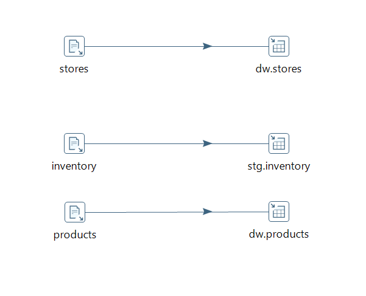
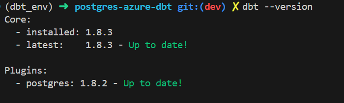
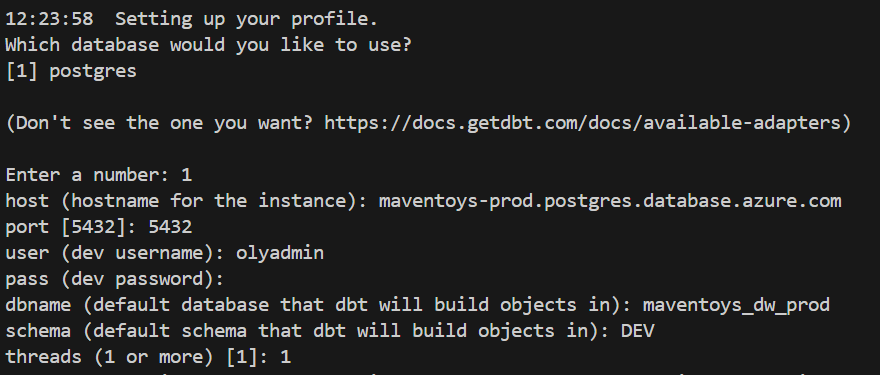
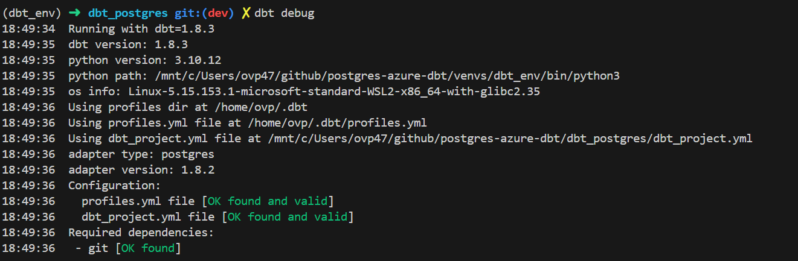
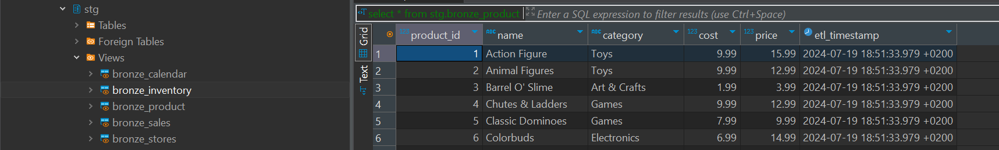

# postgres-azure-dbt

## Overview

This project demonstrates the implementation of a dimensional model on a remote PostgreSQL database hosted on Azure, using Pentaho Data Integration (PDI) for ETL processes.

## Prerequisites

1. Azure service
2. Postgres DB , DBeaver
3. Pentaho Data Integration (PDI)
3. Git
4. Dataset Maven toys
5. DBT
6. python
7. VScode


### Git

1. Create a new repository
2. in VScode create a new branch, in the branch create a new file readme.md and create a PR for this change.


### Azure Database for PostgreSQL flexible server

First, let's create a new server for our databse on the portal Azure.

1. Go to Azure portal
2. Create a new resource group
3. Greate a resourse - > choose Databases -> Azure Database for PostgreSQL
4. Configure the PostgreSQL Server

   Fill in the required details:

    - Subscription: Choose your subscription.

    - Resource Group: Select an existing resource group or create a new one.

    - Server Name: Provide a unique name for your PostgreSQL server.

    - Data Source: Choose "None" unless you are restoring from a backup.

    - Location: Select the Azure region where you want to host your server.

    - Version: Choose the PostgreSQL version you prefer.

    - Compute + Storage: Configure the number of vCores and the amount of storage.

    - Administrator Account: Set the admin username and password.

    - Configure Firewall Rules:

      - Add your IP address or a range of IP addresses to the firewall rules to allow connections.

### Load data to PostgreSQL

1. Go to DBeaver. If you don't have, install it.
2. Open DBeaver
3. Click on  - >  to Database - > New Database Connection.
4. Select ```PostgreSQL``` from the list of database drivers and click ```Next```.

```
  - Host: your-db-host
   - Port: 5432
   - Database: your-db-name
   - Username: your-db-user
   - Password: your-db-password
```

5. Click ```Test Connection``` to ensure that the connection details are correct. Click ```OK``` to save the connection.

6. In DBeaver create schemas STG and DW for the tables by running below SQL Scripts:

- Scriptis to create tables in STG and DW scheme to load the raw data: **create_tables.sql**

### ETL process

The ETL (Extract, Transform, Load) process is handled by Pentaho Data Integration (PDI). The process involves extracting data from source (in our case the data is in CSV), transforming it into the desired format, and loading it into the PostgreSQL database on Azure. Jobs and Transformations are located in ETL.

1. Install Data Integration
2. Open PDI -> Create a new file (tupe transformation) -> Go to design tab
3. Input folder -> CSV file Input -> drag it to new file. Configure it.
4. Output folder -> Table output -> drag it and configurete. Go to the Database Connections and set up a new connection using the details of your DB. test connection.
5. Add a new hop connection between 2 steps.
6. Save and run.



7. We need to extract and load 5 tables: ``` calendar ```, ```sales```, ```products```, ```inventory```, ```stores```.
8. Open DBeaver and run the following queries to check the loaded data:

```
select count(*) from dw.calendar;
select count(*) from dw.products;
select count(*) from dw.stores;
select count(*) from stg.inventory;
select count(*) from stg.sales;

```

### Build models using dbt Core

1. Create a new virtual environment

```

 python3 -m venv venvs/dbt_env      # create the environment

```

2. Activate the dbt_env environment

```
source venvs/dbt_env/bin/activate       # activate the environment for Mac and Linux OR

```
3. Install dbt-core and connect to Postgres

```
python3 -m pip install dbt-postgres

```

4. Check dbt version

```
dbt --version
```


5. Run project

```
dbt init project_name

```


6. Check connection dbt and database

```
dbt debug

```


7. Specify the development and production connection details to deploy models to your data warehouse in either environment. Ensure that profiles.yml uses spaces for indentation instead of tabs.

```
dbt_postgres:
  outputs:
    dev:
      dbname: maventoys_dw_prod
      host: maventoys-prod.postgres.database.azure.com
      pass: ****** #put you password
      port: 5432
      schema: stg  # schema name in DB
      threads: 1
      type: postgres
      user: olyadmin
    prod:
      dbname: maventoys_dw_prod
      host: maventoys-prod.postgres.database.azure.com
      pass: ***** #put you password
      port: 5432
      schema: dw # schema name in DB
      threads: 1
      type: postgres
      user: olyadmin
  target: dev

```

8. Build staging model using Medallion Architecture - in context of ```dbt``` . The project structure will look like this:

```
    ├── dbt_postgres/
    │   ├── models/
    │   │   ├── bronze/
    │   │   │   ├── stg_sales.sql
    │   │   │   ├── stg_inventory.sql
    │   │   │   ├── stg_calendar.sql
    │   │   │   ├── stg_stores.sql
    │   │   │   ├── stg_product.sql
    │   │   ├── silver/
    │   │   │   ├── mrt_sales.sql
    │   │   │   ├── mrt_inventory.sql
    │   │   │   ├── dim_calendar.sql
    │   │   │   ├── dim_stores.sql
    │   │   │   ├── dim_product.sql
    │   │   ├── gold/
    │   │   │   ├── inventory_sales_summary.sql
    │   │   │   ├── sales_product_summary.sql
    │   │   ├── sources.yml
    │   ├── dbt_project.yml
    ├── venvs/
    ├── .gitignore
    ├── README.md
```


Running models:
```
-- bronze models

dbt run --select stg_sales --target dev
dbt run --select stg_inventory --target dev
dbt run --select stg_calendar --target dev
dbt run --select stg_stores --target dev
dbt run --select stg_product --target dev
```

9. Pre-commit

Using pre-commit hooks in a development workflow offers several benefits that help maintain code quality, enforce coding standards, and catch errors early in the development process.

```
# Navigate to your repository if not already there
cd path/to/your/postgres-azure-dbt

# Create the .pre-commit-config.yaml file
touch .pre-commit-config.yaml

# Open the file in a text editor and add the content
echo 'repos:
  - repo: https://github.com/pre-commit/pre-commit-hooks
    rev: v4.3.0
    hooks:
      - id: trailing-whitespace
      - id: end-of-file-fixer
      - id: check-yaml

  - repo: https://github.com/sqlfluff/sqlfluff
    rev: v1.1.1
    hooks:
      - id: sqlfluff-lint
        args: ["--dialect", "postgres"]' > .pre-commit-config.yaml

# Install Pre-Commit
pip install pre-commit

# Install Sqlfluff
pip install sqlfluff

# Install the pre-commit hooks
pre-commit install

# Run pre-commit on all files
pre-commit run --all-files

# Add and commit the changes
git add .pre-commit-config.yaml
git commit -m "Add pre-commit configuration for YAML, trailing whitespace, and SQL linting"

# Push the changes to the repository
git push origin main  # or your current branch

```

10. Add the dbt freshness test

When considering freshness tests in DBT, it's generally a best practice to check the raw data tables, especially if you want to ensure that the data pipeline is functioning correctly from the very beginning. Freshness tests help to ensure that the data being ingested into your system is up-to-date and reflects the latest available inf.

However, there are cases where it might make sense to check the freshness of the staging (stg) tables at the
 - Raw Data Availability
 - Staging Tables as Source
 - Data Processing Delays

```warn_after: {count: 1, period: day}```
This setting specifies that a warning should be raised if the data is older than 1 day. The count and period parameters together define the threshold for when the warning should be triggered. In this case, if the data hasn't been updated in more than 1 day, dbt will generate a warning.
```error_after: {count: 2, period: day}``` This setting specifies that an error should be raised if the data is older than 2 days. Similar to the warn_after parameter, the count and period parameters together define the threshold for when the error should be triggered.
Run ```dbt source freshness``` .

11. Generic test

Create ```schema.yml``` file
